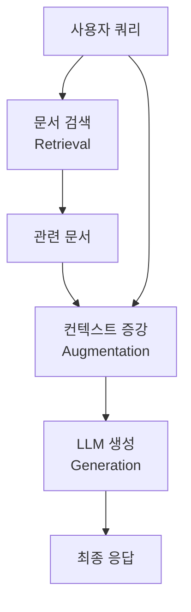

# W2_002_Simple_RAG_Pipeline.md - 기본 RAG 파이프라인 구축

## 🎯 학습 목표
- RAG(Retrieval-Augmented Generation)의 개념과 아키텍처 이해
- 문서 전처리부터 응답 생성까지의 전체 파이프라인 구축 능력 습득
- LangChain을 활용한 실전 RAG 시스템 구현 기법 학습
- 검색 기반 질문 답변 시스템의 성능 평가 방법 이해

## 📚 핵심 개념

### RAG(Retrieval-Augmented Generation)란?
- **개념**: 검색 증강 생성, 외부 지식을 동적으로 검색하여 응답 생성에 활용
- **배경**: 기존 LLM의 고정된 훈련 데이터 한계를 극복
- **장점**: 최신 정보, 도메인 특화 지식, 사실 기반 응답 가능
- **구성**: Retrieval(검색) + Augmentation(증강) + Generation(생성)

### RAG vs 기존 접근법 비교

| 특성 | 기존 LLM | 파인튜닝 | RAG |
|------|----------|----------|-----|
| 최신 정보 | ❌ | ❌ | ✅ |
| 구현 복잡도 | 낮음 | 높음 | 중간 |
| 계산 비용 | 낮음 | 높음 | 중간 |
| 소스 추적 | ❌ | ❌ | ✅ |
| 환각 방지 | ❌ | △ | ✅ |

### RAG 아키텍처


## 🔧 환경 설정

### 필수 라이브러리 설치
```bash
# 기본 LangChain 라이브러리
pip install langchain langchain-community langchain-openai

# 문서 처리 및 웹 스크래핑
pip install beautifulsoup4 langchain_text_splitters

# 벡터 데이터베이스
pip install langchain-chroma faiss-cpu

# UV 패키지 매니저 사용 시
uv add langchain langchain-community langchain-openai beautifulsoup4 langchain_text_splitters langchain-chroma faiss-cpu
```

### 환경 변수 설정
```python
from dotenv import load_dotenv
load_dotenv()
```

## 💻 RAG 파이프라인 구현

### Step 1: Indexing (인덱싱)

RAG 시스템의 첫 번째 단계는 지식 베이스 구축입니다.

#### 1.1 문서 데이터 로드 (Load Data)

```python
from langchain_community.document_loaders import WebBaseLoader

# 웹페이지에서 데이터 로드
url = 'https://ko.wikipedia.org/wiki/%EC%9C%84%ED%82%A4%EB%B0%B1%EA%B3%BC:%EC%A0%95%EC%B1%85%EA%B3%BC_%EC%A7%80%EC%B9%A8'
loader = WebBaseLoader(url)

# 웹페이지 텍스트를 Document 객체로 변환
docs = loader.load()

print(f"Document 개수: {len(docs)}")
print(f"Document 길이: {len(docs[0].page_content)}")
print(f"Document 내용 샘플: {docs[0].page_content[5000:5500]}")

# Document 메타데이터 확인
print(f"메타데이터: {docs[0].metadata}")
```

#### 1.2 문서 청크 분할 (Split Texts)

```python
from langchain_text_splitters import CharacterTextSplitter

# 청크 분할 전략
text_splitter = CharacterTextSplitter(
    separator="\n\n",      # 문단 구분자
    chunk_size=1000,       # 청크 크기
    chunk_overlap=200,     # 겹치는 영역
    length_function=len,   # 길이 측정 함수
    is_separator_regex=False
)

splitted_docs = text_splitter.split_documents(docs)

print(f"분할된 Document 개수: {len(splitted_docs)}")

# 각 청크 확인
for i, doc in enumerate(splitted_docs[:3]):
    print(f"\nDocument {i} 길이: {len(doc.page_content)}")
    print(f"Document {i} 내용: {doc.page_content[:100]}...")
    print("-" * 50)
```

#### 청크 분할 전략 비교

```python
# 균등 분할 방식
text_splitter_equal = CharacterTextSplitter(
    separator="",          # 문자 단위 분할
    chunk_size=1000,       # 엄격한 1000자 제한
    length_function=len,
    is_separator_regex=False
)

equally_splitted_docs = text_splitter_equal.split_documents(docs)

print(f"균등 분할 Document 개수: {len(equally_splitted_docs)}")

# 길이 분포 확인
for i, doc in enumerate(equally_splitted_docs):
    print(f"Document {i} 길이: {len(doc.page_content)}")
```

#### 1.3 문서 임베딩 생성 (Document Embeddings)

```python
from langchain_openai import OpenAIEmbeddings

# OpenAI 임베딩 모델 초기화
embedding_model = OpenAIEmbeddings(
    model="text-embedding-3-small"  # 성능과 비용의 균형
)

# 샘플 텍스트 임베딩 테스트
sample_text = "위키피디아 정책 변경 절차를 알려주세요"
embedding_vector = embedding_model.embed_query(sample_text)

print(f"임베딩 벡터 차원: {len(embedding_vector)}")
print(f"임베딩 벡터 샘플: {embedding_vector[:10]}...")
```

#### 1.4 벡터 저장소 구축 (Vectorstores)

```python
from langchain_chroma import Chroma

# Chroma 벡터 저장소 초기화
vector_store = Chroma(embedding_function=embedding_model)

# Document들을 벡터 저장소에 추가
document_ids = vector_store.add_documents(splitted_docs)

print(f"저장된 Document 개수: {len(document_ids)}")
print(f"Document ID 샘플: {document_ids[:3]}")

# 저장소 상태 확인
print(f"벡터 저장소 총 Document 수: {vector_store._collection.count()}")
```

### Step 2: Retrieval and Generation (검색 및 생성)

#### 2.1 유사도 기반 문서 검색

```python
# 직접적인 유사도 검색
search_query = "위키피디아 정책 변경 절차를 알려주세요"

results = vector_store.similarity_search(query=search_query, k=2)

print("검색 결과:")
for i, doc in enumerate(results):
    print(f"\n{i+1}. {doc.page_content[:200]}...")
    print(f"   메타데이터: {doc.metadata}")
    print("-" * 50)
```

#### 2.2 Retriever 설정

```python
# 검색기 설정
retriever = vector_store.as_retriever(
    search_type="similarity",
    search_kwargs={"k": 2}  # 상위 2개 문서 검색
)

# 검색기를 통한 검색
retrieved_docs = retriever.invoke(input=search_query)

print("검색기 결과:")
for doc in retrieved_docs:
    print(f"* {doc.page_content[:100]}...")
    print(f"  [{doc.metadata}]")
    print("-" * 50)
```

#### 2.3 RAG 체인 구성

```python
from langchain_openai import ChatOpenAI
from langchain_core.prompts import ChatPromptTemplate
from langchain.chains import create_retrieval_chain
from langchain.chains.combine_documents import create_stuff_documents_chain

# 시스템 프롬프트 정의
system_prompt = (
    "다음 검색된 맥락을 사용하여 사용자의 질문에 답하세요. "
    "답을 모르면 모른다고 하고, 추측하지 마세요. "
    "답변은 한국어로 간결하고 정확하게 작성하세요.\n\n"
    "{context}"
)

# 프롬프트 템플릿 생성
prompt = ChatPromptTemplate.from_messages([
    ("system", system_prompt),
    ("human", "{input}")
])

# LLM 모델 설정
llm = ChatOpenAI(model="gpt-4.1-mini", temperature=0)

# 문서 처리 체인 생성
question_answer_chain = create_stuff_documents_chain(llm, prompt)

# 전체 RAG 체인 생성
rag_chain = create_retrieval_chain(retriever, question_answer_chain)
```

#### 2.4 RAG 체인 실행

```python
# 질의 실행
query = "위키피디아 정책 변경 절차를 알려주세요"
response = rag_chain.invoke({"input": query})

# 응답 분석
print("=== RAG 시스템 응답 ===")
print(response['answer'])

print(f"\n=== 사용된 문서 ({len(response['context'])}개) ===")
for i, doc in enumerate(response['context'], 1):
    print(f"{i}. {doc.page_content[:150]}...")
    print(f"   출처: {doc.metadata['source']}")
    print("-" * 50)
```

## 🚀 실습해보기

### 실습: 뉴스 기사 RAG 시스템 구축

**목표**: 여러 뉴스 기사를 기반으로 한 질문 답변 시스템 구현

#### 단계별 구현

```python
from langchain_community.document_loaders import WebBaseLoader
from langchain_text_splitters import CharacterTextSplitter
from langchain_openai import OpenAIEmbeddings, ChatOpenAI
from langchain_chroma import Chroma
from langchain_core.prompts import ChatPromptTemplate
from langchain.chains import create_retrieval_chain
from langchain.chains.combine_documents import create_stuff_documents_chain

# 1단계: 뉴스 데이터 수집
web_urls = [
    "https://n.news.naver.com/mnews/article/029/0002927209",
    "https://n.news.naver.com/mnews/article/092/0002358620",
    "https://n.news.naver.com/mnews/article/008/0005136824",
]

# 2단계: 문서 로드
loader = WebBaseLoader(web_urls)
docs = loader.load()
print(f"로드된 문서 수: {len(docs)}")

# 3단계: 문서 분할
text_splitter = CharacterTextSplitter(
    chunk_size=1000,
    chunk_overlap=200,
    length_function=len
)
splitted_docs = text_splitter.split_documents(docs)
print(f"분할된 청크 수: {len(splitted_docs)}")

# 4단계: 벡터 저장소 구축
embedding_model = OpenAIEmbeddings(model="text-embedding-3-small")
vector_store = Chroma(embedding_function=embedding_model)
document_ids = vector_store.add_documents(splitted_docs)
print(f"벡터 저장소 문서 수: {len(document_ids)}")

# 5단계: RAG 체인 구성
retriever = vector_store.as_retriever(
    search_type="similarity",
    search_kwargs={"k": 2}
)

system_prompt = (
    "다음 검색된 맥락을 사용하여 사용자의 질문에 답하세요. "
    "답을 모르면 모른다고 하고, 추측하지 마세요. "
    "답변은 한국어로 간결하고 정확하게 작성하세요.\n\n"
    "{context}"
)

prompt = ChatPromptTemplate.from_messages([
    ("system", system_prompt),
    ("human", "{input}")
])

llm = ChatOpenAI(model="gpt-4o-mini", temperature=0)

question_answer_chain = create_stuff_documents_chain(llm, prompt)
rag_chain = create_retrieval_chain(retriever, question_answer_chain)

# 6단계: 질문 답변 테스트
query = "뉴스 기사에서 주요 내용을 요약해 주세요"
response = rag_chain.invoke({"input": query})

print("=== RAG 시스템 응답 ===")
print(response['answer'])
```

### 고급 실습: RAG 성능 개선

#### 검색 파라미터 튜닝

```python
class AdvancedRAGSystem:
    def __init__(self, documents):
        self.documents = documents
        self.vector_store = None
        self.retriever = None
        self.rag_chain = None

    def setup_vectorstore(self, chunk_size=1000, chunk_overlap=200):
        """벡터 저장소 설정"""
        text_splitter = CharacterTextSplitter(
            chunk_size=chunk_size,
            chunk_overlap=chunk_overlap,
            length_function=len
        )

        splitted_docs = text_splitter.split_documents(self.documents)

        embedding_model = OpenAIEmbeddings(model="text-embedding-3-small")
        self.vector_store = Chroma(embedding_function=embedding_model)
        self.vector_store.add_documents(splitted_docs)

        return len(splitted_docs)

    def setup_retriever(self, search_type="similarity", k=3):
        """검색기 설정"""
        if not self.vector_store:
            raise ValueError("Vector store not initialized")

        self.retriever = self.vector_store.as_retriever(
            search_type=search_type,
            search_kwargs={"k": k}
        )

    def setup_rag_chain(self, model_name="gpt-4.1-mini", temperature=0):
        """RAG 체인 설정"""
        if not self.retriever:
            raise ValueError("Retriever not initialized")

        system_prompt = (
            "다음 검색된 맥락을 사용하여 사용자의 질문에 답하세요. "
            "답을 모르면 모른다고 하고, 추측하지 마세요. "
            "답변은 한국어로 간결하고 정확하게 작성하세요.\n\n"
            "{context}"
        )

        prompt = ChatPromptTemplate.from_messages([
            ("system", system_prompt),
            ("human", "{input}")
        ])

        llm = ChatOpenAI(model=model_name, temperature=temperature)

        question_answer_chain = create_stuff_documents_chain(llm, prompt)
        self.rag_chain = create_retrieval_chain(self.retriever, question_answer_chain)

    def query(self, question):
        """질문 처리"""
        if not self.rag_chain:
            raise ValueError("RAG chain not initialized")

        response = self.rag_chain.invoke({"input": question})
        return {
            'answer': response['answer'],
            'source_documents': response['context'],
            'source_count': len(response['context'])
        }

# 사용 예제
rag_system = AdvancedRAGSystem(docs)

# 시스템 설정
chunk_count = rag_system.setup_vectorstore(chunk_size=800, chunk_overlap=150)
rag_system.setup_retriever(search_type="similarity", k=3)
rag_system.setup_rag_chain(model_name="gpt-4.1-mini")

print(f"시스템 설정 완료 - 총 {chunk_count}개 청크 생성")

# 질문 처리
result = rag_system.query("위키피디아에서 정책을 어떻게 변경하나요?")

print("=== 향상된 RAG 시스템 응답 ===")
print(result['answer'])
print(f"\n사용된 소스 문서: {result['source_count']}개")
```

## 📋 해답

### 완전한 RAG 파이프라인 구현

```python
import os
from typing import List, Dict, Any
from langchain_community.document_loaders import WebBaseLoader
from langchain_text_splitters import CharacterTextSplitter
from langchain_openai import OpenAIEmbeddings, ChatOpenAI
from langchain_chroma import Chroma
from langchain_core.prompts import ChatPromptTemplate
from langchain.chains import create_retrieval_chain
from langchain.chains.combine_documents import create_stuff_documents_chain
from langchain_core.documents import Document

class ComprehensiveRAGPipeline:
    """포괄적인 RAG 파이프라인 구현"""

    def __init__(self):
        self.docs = []
        self.splitted_docs = []
        self.vector_store = None
        self.retriever = None
        self.rag_chain = None
        self.embedding_model = None

    def load_documents(self, sources: List[str]) -> int:
        """다양한 소스에서 문서 로드"""
        all_docs = []

        # 웹 URL 처리
        web_urls = [s for s in sources if s.startswith('http')]
        if web_urls:
            web_loader = WebBaseLoader(web_urls)
            web_docs = web_loader.load()
            all_docs.extend(web_docs)

        # 텍스트 직접 입력 처리
        text_sources = [s for s in sources if not s.startswith('http')]
        for text in text_sources:
            doc = Document(page_content=text, metadata={"source": "direct_input"})
            all_docs.append(doc)

        self.docs = all_docs
        return len(self.docs)

    def split_documents(self, chunk_size: int = 1000, chunk_overlap: int = 200) -> int:
        """문서를 청크로 분할"""
        if not self.docs:
            raise ValueError("문서가 로드되지 않았습니다.")

        text_splitter = CharacterTextSplitter(
            chunk_size=chunk_size,
            chunk_overlap=chunk_overlap,
            length_function=len,
            is_separator_regex=False
        )

        self.splitted_docs = text_splitter.split_documents(self.docs)
        return len(self.splitted_docs)

    def create_vectorstore(self, embedding_model_name: str = "text-embedding-3-small"):
        """벡터 저장소 생성"""
        if not self.splitted_docs:
            raise ValueError("문서가 분할되지 않았습니다.")

        self.embedding_model = OpenAIEmbeddings(model=embedding_model_name)
        self.vector_store = Chroma(embedding_function=self.embedding_model)

        # 문서를 벡터 저장소에 추가
        document_ids = self.vector_store.add_documents(self.splitted_docs)
        return len(document_ids)

    def setup_retriever(self, search_type: str = "similarity", k: int = 3):
        """검색기 설정"""
        if not self.vector_store:
            raise ValueError("벡터 저장소가 생성되지 않았습니다.")

        self.retriever = self.vector_store.as_retriever(
            search_type=search_type,
            search_kwargs={"k": k}
        )

    def create_rag_chain(self,
                        model_name: str = "gpt-4.1-mini",
                        temperature: float = 0,
                        custom_prompt: str = None):
        """RAG 체인 생성"""
        if not self.retriever:
            raise ValueError("검색기가 설정되지 않았습니다.")

        # 시스템 프롬프트 설정
        if custom_prompt is None:
            system_prompt = (
                "다음 검색된 맥락을 사용하여 사용자의 질문에 답하세요. "
                "답을 모르면 모른다고 하고, 추측하지 마세요. "
                "답변은 한국어로 간결하고 정확하게 작성하세요. "
                "가능한 경우 출처를 명시해주세요.\n\n"
                "{context}"
            )
        else:
            system_prompt = custom_prompt

        prompt = ChatPromptTemplate.from_messages([
            ("system", system_prompt),
            ("human", "{input}")
        ])

        llm = ChatOpenAI(model=model_name, temperature=temperature)

        question_answer_chain = create_stuff_documents_chain(llm, prompt)
        self.rag_chain = create_retrieval_chain(self.retriever, question_answer_chain)

    def query(self, question: str) -> Dict[str, Any]:
        """질문에 대한 답변 생성"""
        if not self.rag_chain:
            raise ValueError("RAG 체인이 생성되지 않았습니다.")

        response = self.rag_chain.invoke({"input": question})

        return {
            'question': question,
            'answer': response['answer'],
            'source_documents': response['context'],
            'source_count': len(response['context']),
            'sources': list(set([doc.metadata.get('source', 'unknown')
                               for doc in response['context']]))
        }

    def batch_query(self, questions: List[str]) -> List[Dict[str, Any]]:
        """여러 질문에 대한 배치 처리"""
        results = []
        for question in questions:
            try:
                result = self.query(question)
                results.append(result)
            except Exception as e:
                results.append({
                    'question': question,
                    'answer': f"오류 발생: {str(e)}",
                    'error': True
                })
        return results

    def get_pipeline_info(self) -> Dict[str, Any]:
        """파이프라인 상태 정보"""
        return {
            'total_documents': len(self.docs),
            'total_chunks': len(self.splitted_docs),
            'vector_store_count': self.vector_store._collection.count() if self.vector_store else 0,
            'embedding_model': self.embedding_model.model if self.embedding_model else None,
            'retriever_configured': self.retriever is not None,
            'rag_chain_configured': self.rag_chain is not None
        }

# 사용 예제
def demonstrate_rag_pipeline():
    """RAG 파이프라인 데모"""
    # 파이프라인 초기화
    rag = ComprehensiveRAGPipeline()

    # 1. 문서 로드
    sources = [
        'https://ko.wikipedia.org/wiki/%EC%9C%84%ED%82%A4%EB%B0%B1%EC%B3%90:%EC%A0%95%EC%B1%85%EA%B3%BC_%EC%A7%80%EC%B9%A8'
    ]
    doc_count = rag.load_documents(sources)
    print(f"✅ {doc_count}개 문서 로드 완료")

    # 2. 문서 분할
    chunk_count = rag.split_documents(chunk_size=800, chunk_overlap=150)
    print(f"✅ {chunk_count}개 청크로 분할 완료")

    # 3. 벡터 저장소 생성
    vector_count = rag.create_vectorstore()
    print(f"✅ {vector_count}개 벡터 저장 완료")

    # 4. 검색기 설정
    rag.setup_retriever(k=3)
    print("✅ 검색기 설정 완료")

    # 5. RAG 체인 생성
    rag.create_rag_chain()
    print("✅ RAG 체인 생성 완료")

    # 6. 파이프라인 정보 출력
    info = rag.get_pipeline_info()
    print(f"\n📊 파이프라인 정보: {info}")

    # 7. 질문 답변 테스트
    test_questions = [
        "위키피디아 정책은 어떻게 변경하나요?",
        "새로운 정책을 제안하는 과정은 무엇인가요?",
        "정책 위반 시 어떤 조치가 취해지나요?"
    ]

    print("\n🔍 질문 답변 테스트:")
    results = rag.batch_query(test_questions)

    for i, result in enumerate(results, 1):
        print(f"\n{i}. 질문: {result['question']}")
        print(f"   답변: {result['answer'][:200]}...")
        if 'source_count' in result:
            print(f"   사용된 소스: {result['source_count']}개")
            print(f"   출처: {', '.join(result['sources'])}")
        print("-" * 80)

    return rag

# 실행
if __name__ == "__main__":
    rag_pipeline = demonstrate_rag_pipeline()
```

## 🔍 성능 최적화 팁

### 청크 크기 최적화

```python
def optimize_chunk_size(documents, test_questions, chunk_sizes=[500, 800, 1000, 1200]):
    """청크 크기별 성능 비교"""
    results = {}

    for chunk_size in chunk_sizes:
        rag = ComprehensiveRAGPipeline()
        rag.docs = documents

        chunk_count = rag.split_documents(chunk_size=chunk_size)
        rag.create_vectorstore()
        rag.setup_retriever(k=2)
        rag.create_rag_chain()

        # 응답 시간 측정
        import time
        start_time = time.time()

        responses = []
        for question in test_questions:
            result = rag.query(question)
            responses.append(result)

        end_time = time.time()

        results[chunk_size] = {
            'chunk_count': chunk_count,
            'response_time': end_time - start_time,
            'avg_response_length': sum(len(r['answer']) for r in responses) / len(responses)
        }

    return results

# 성능 분석 결과 출력
def print_optimization_results(results):
    print("청크 크기별 성능 비교:")
    print(f"{'청크 크기':<10} {'청크 수':<10} {'응답 시간':<12} {'평균 응답 길이':<15}")
    print("-" * 50)

    for chunk_size, metrics in results.items():
        print(f"{chunk_size:<10} {metrics['chunk_count']:<10} "
              f"{metrics['response_time']:.2f}s{'':<6} "
              f"{metrics['avg_response_length']:.1f}{'':<10}")
```

## 📚 참고 자료

### 공식 문서
- [LangChain RAG Tutorial](https://python.langchain.com/docs/tutorials/rag/) - 공식 RAG 튜토리얼
- [LangChain Document Loaders](https://python.langchain.com/docs/integrations/document_loaders/) - 문서 로더 종류
- [LangChain Text Splitters](https://python.langchain.com/docs/concepts/text_splitters/) - 텍스트 분할 전략
- [LangChain Vector Stores](https://python.langchain.com/docs/integrations/vectorstores/) - 벡터 데이터베이스

### 학습 자료
- [RAG 아키텍처 가이드](https://blog.langchain.dev/rag-from-scratch/) - RAG 개념과 구현
- [Chroma 벡터 데이터베이스](https://docs.trychroma.com/) - 벡터 저장소 활용법
- [OpenAI Embeddings](https://platform.openai.com/docs/guides/embeddings) - 임베딩 모델 가이드

### 개발 도구
- [LangSmith](https://smith.langchain.com/) - RAG 성능 모니터링
- [Chroma](https://www.trychroma.com/) - 벡터 데이터베이스
- [FAISS](https://github.com/facebookresearch/faiss) - 고성능 벡터 검색

### 추가 학습
- 하이브리드 검색 (키워드 + 의미 검색)
- RAG 성능 평가 메트릭
- 실시간 문서 업데이트 전략
- 멀티모달 RAG 시스템