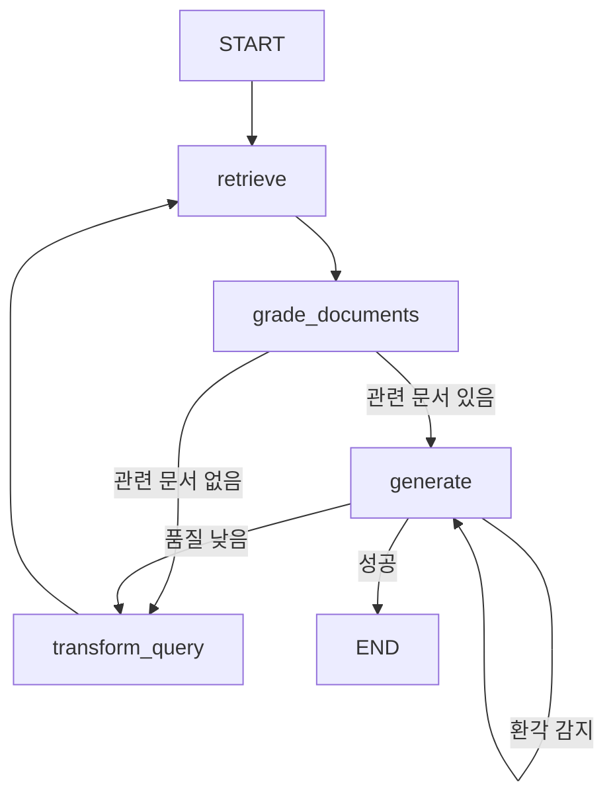

# LangGraph 활용 - Self-RAG (Part 2) - LangGraph 통합 워크플로우

## 📚 학습 목표

이 학습 가이드를 완료하면 다음을 수행할 수 있습니다:

1. **LangGraph State 설계**: Self-RAG 워크플로우를 위한 상태 구조를 정의할 수 있습니다
2. **Node 함수 구현**: 각 처리 단계를 독립적인 Node로 구현할 수 있습니다
3. **조건부 라우팅**: Edge를 사용하여 상태 기반 분기 로직을 구현할 수 있습니다
4. **그래프 구축**: StateGraph로 전체 워크플로우를 연결하고 컴파일할 수 있습니다
5. **워크플로우 시각화**: Mermaid를 사용하여 그래프를 시각적으로 표현할 수 있습니다
6. **스트리밍 실행**: 그래프를 스트리밍 모드로 실행하여 단계별 진행 상황을 추적할 수 있습니다
7. **실전 프로젝트**: 법률 문서 QA 시스템을 Self-RAG로 구현할 수 있습니다

## 🔑 핵심 개념

### LangGraph란?

**LangGraph**는 LLM 애플리케이션을 그래프 기반 워크플로우로 구성할 수 있는 프레임워크입니다.

#### 주요 구성 요소

```
┌─────────────────────────────────────────────────────────────┐
│                    LangGraph 구조                           │
├─────────────────────────────────────────────────────────────┤
│                                                              │
│  ┌──────────┐         ┌──────────┐         ┌──────────┐   │
│  │  State   │────────▶│   Node   │────────▶│   Edge   │   │
│  └──────────┘         └──────────┘         └──────────┘   │
│       │                     │                     │         │
│       │                     │                     │         │
│  공유 데이터              처리 단계           흐름 제어      │
│  구조 정의                함수 정의           조건부 분기    │
│                                                              │
└─────────────────────────────────────────────────────────────┘
```

#### 1. State (상태)

그래프 전체에서 공유되는 데이터 구조:

```python
from typing import TypedDict, List
from langchain_core.documents import Document

class GraphState(TypedDict):
    question: str                 # 사용자 질문
    generation: str               # 생성된 답변
    documents: List[Document]     # 검색된 문서
    num_generations: int          # 재시도 횟수
```

특징:
- **TypedDict 기반**: 타입 안전성 보장
- **불변성 원칙**: Node는 새로운 상태를 반환 (기존 상태 수정 X)
- **부분 업데이트**: 변경된 키만 반환하면 자동으로 병합

#### 2. Node (노드)

각 처리 단계를 수행하는 함수:

```python
def retrieve(state: GraphState) -> GraphState:
    """문서 검색 노드"""
    question = state["question"]

    # 벡터 DB에서 문서 검색
    documents = vector_db.similarity_search(question)

    # 변경된 부분만 반환
    return {"documents": documents}
```

특징:
- **입력**: 현재 State
- **처리**: 특정 작업 수행
- **출력**: 업데이트할 State (부분)

#### 3. Edge (엣지)

Node 간 연결과 흐름 제어:

**일반 Edge (무조건 연결)**:
```python
builder.add_edge("retrieve", "grade_documents")
# retrieve 노드 → grade_documents 노드 (항상)
```

**조건부 Edge (상태 기반 분기)**:
```python
def decide_to_generate(state: GraphState) -> str:
    """다음 노드를 결정하는 함수"""
    filtered_documents = state["documents"]

    if not filtered_documents:
        return "transform_query"  # 문서 없음 → 질문 재작성
    else:
        return "generate"         # 문서 있음 → 답변 생성

builder.add_conditional_edges(
    "grade_documents",           # 출발 노드
    decide_to_generate,          # 결정 함수
    {
        "transform_query": "transform_query",
        "generate": "generate"
    }
)
```

### Self-RAG 워크플로우 그래프

```
                    ┌─────────┐
                    │  START  │
                    └────┬────┘
                         │
                    ┌────▼────┐
                    │retrieve │ 1. 문서 검색
                    └────┬────┘
                         │
                ┌────────▼──────────┐
                │ grade_documents   │ 2. 문서 관련성 평가
                └────────┬──────────┘
                         │
          ┌──────────────┴──────────────┐
          │                             │
     (관련 문서 없음)              (관련 문서 있음)
          │                             │
    ┌─────▼─────┐                 ┌────▼────┐
    │transform   │                 │generate │ 3. 답변 생성
    │  _query    │                 └────┬────┘
    └─────┬─────┘                       │
          │                    ┌────────┴────────┐
          │                    │                 │
          │               (환각 감지)      (환각 없음)
          │                    │                 │
          │                    │          ┌──────▼──────┐
          │                    │          │답변 품질 평가│
          │                    │          └──────┬──────┘
          │                    │                 │
          │                    │        ┌────────┴────────┐
          │                    │        │                 │
          │                    │   (품질 낮음)      (품질 높음)
          │                    │        │                 │
          └────────────────────┴────────┘            ┌────▼────┐
                         │                           │   END   │
                    (재검색)                         └─────────┘
```

### LangGraph의 장점

1. **명확한 구조**: 복잡한 로직을 시각화 가능한 그래프로 표현
2. **상태 관리**: 각 단계의 상태를 자동으로 추적
3. **조건부 분기**: 동적인 의사결정 흐름 구현
4. **재사용성**: Node와 Edge를 모듈화하여 재사용
5. **디버깅**: 각 단계별 결과를 쉽게 추적

## 🛠 환경 설정

### 추가 라이브러리 설치

```bash
pip install langgraph
```

### 전체 라이브러리 목록

```bash
pip install langchain langchain-openai langchain-chroma langchain-core
pip install pydantic python-dotenv openai chromadb
pip install langgraph  # LangGraph 추가
```

### 기본 설정 코드

```python
from dotenv import load_dotenv
import os

# 환경 변수 로드
load_dotenv()

# LangGraph 관련 임포트
from typing import List, TypedDict
from langgraph.graph import StateGraph, START, END
from langchain_core.documents import Document

# Part 1에서 구현한 컴포넌트들
from langchain_chroma import Chroma
from langchain_openai import OpenAIEmbeddings, ChatOpenAI
from pydantic import BaseModel, Field

# 벡터 DB 및 평가자 초기화 (Part 1에서 구현)
embeddings_model = OpenAIEmbeddings(model="text-embedding-3-small")
vector_db = Chroma(
    embedding_function=embeddings_model,
    collection_name="restaurant_menu",
    persist_directory="./chroma_db"
)

# Part 1에서 구현한 retrieval_grader, hallucination_grader,
# answer_grader, generate_answer, rewrite_question 함수 사용
```

## 💻 단계별 구현

### 단계 1: GraphState 정의

LangGraph의 핵심은 State입니다. Self-RAG 워크플로우에 필요한 모든 정보를 담는 State를 정의합니다.

```python
from typing import List, TypedDict
from langchain_core.documents import Document

class GraphState(TypedDict):
    """
    Self-RAG 그래프의 상태를 정의합니다.

    Attributes:
        question: 사용자의 질문 (재작성될 수 있음)
        generation: LLM이 생성한 답변
        documents: 검색된 문서 리스트
        num_generations: 생성/재시도 횟수 (무한 루프 방지)
    """
    question: str                 # 사용자 질문
    generation: str               # 생성된 답변
    documents: List[Document]     # 검색된 문서
    num_generations: int          # 생성 횟수
```

**State 설계 원칙**:

1. **필수 정보만 포함**: 워크플로우에 반드시 필요한 데이터만
2. **타입 명시**: TypedDict로 각 필드의 타입 지정
3. **문서화**: 각 필드의 역할을 명확히 설명
4. **확장 가능성**: 필요시 추가 필드 손쉽게 추가

### 단계 2: Node 함수 구현

각 처리 단계를 독립적인 Node 함수로 구현합니다.

#### Node 1: retrieve (문서 검색)

```python
def retrieve(state: GraphState) -> GraphState:
    """
    벡터 DB에서 관련 문서를 검색합니다.

    Args:
        state: 현재 그래프 상태 (question 필요)

    Returns:
        업데이트된 상태 (documents 추가)
    """
    print("🔍 [Node: retrieve] 문서 검색 중...")

    question = state["question"]

    # 벡터 DB에서 유사도 검색
    documents = vector_db.similarity_search(question, k=3)

    print(f"   검색된 문서: {len(documents)}개")

    # 변경된 부분만 반환 (documents만 업데이트)
    return {"documents": documents}
```

#### Node 2: grade_documents (문서 관련성 평가)

```python
def grade_documents(state: GraphState) -> GraphState:
    """
    검색된 문서의 관련성을 평가하고 필터링합니다.

    Args:
        state: 현재 그래프 상태 (question, documents 필요)

    Returns:
        업데이트된 상태 (관련 문서만 남김)
    """
    print("📋 [Node: grade_documents] 문서 관련성 평가 중...")

    question = state["question"]
    documents = state["documents"]

    # 관련 있는 문서만 필터링
    filtered_docs = []
    for doc in documents:
        # Part 1에서 구현한 retrieval_grader 사용
        score = retrieval_grader.invoke({
            "question": question,
            "document": doc.page_content
        })

        if score.binary_score == "yes":
            print(f"   ✅ 관련 문서 발견")
            filtered_docs.append(doc)
        else:
            print(f"   ❌ 관련 없는 문서 제외")

    print(f"   최종 관련 문서: {len(filtered_docs)}/{len(documents)}개")

    return {"documents": filtered_docs}
```

#### Node 3: generate (답변 생성)

```python
def generate(state: GraphState) -> GraphState:
    """
    관련 문서를 기반으로 답변을 생성합니다.

    Args:
        state: 현재 그래프 상태 (question, documents 필요)

    Returns:
        업데이트된 상태 (generation, num_generations 추가)
    """
    print("💡 [Node: generate] 답변 생성 중...")

    question = state["question"]
    documents = state["documents"]

    # Part 1에서 구현한 generate_answer 함수 사용
    generation = generate_answer(question, docs=documents)

    print(f"   답변: {generation[:100]}...")

    # 생성 횟수 업데이트
    num_generations = state.get("num_generations", 0)
    num_generations += 1

    return {
        "generation": generation,
        "num_generations": num_generations
    }
```

#### Node 4: transform_query (질문 재작성)

```python
def transform_query(state: GraphState) -> GraphState:
    """
    검색에 실패한 경우 질문을 개선합니다.

    Args:
        state: 현재 그래프 상태 (question 필요)

    Returns:
        업데이트된 상태 (개선된 question, num_generations)
    """
    print("🔄 [Node: transform_query] 질문 재작성 중...")

    question = state["question"]

    # Part 1에서 구현한 rewrite_question 함수 사용
    rewritten_question = rewrite_question(question)

    print(f"   원본: {question}")
    print(f"   개선: {rewritten_question}")

    # 생성 횟수 업데이트
    num_generations = state.get("num_generations", 0)
    num_generations += 1

    return {
        "question": rewritten_question,
        "num_generations": num_generations
    }
```

### 단계 3: Edge 조건부 함수 구현

Node 간 흐름을 제어하는 조건부 함수를 구현합니다.

#### Edge 1: decide_to_generate (답변 생성 여부 결정)

```python
def decide_to_generate(state: GraphState) -> str:
    """
    문서 평가 후 다음 단계를 결정합니다.

    Args:
        state: 현재 그래프 상태

    Returns:
        다음 노드 이름 ("generate" 또는 "transform_query")
    """
    print("🤔 [Edge: decide_to_generate] 다음 단계 결정 중...")

    # 무한 루프 방지: 최대 생성 횟수 초과 시 강제 생성
    num_generations = state.get("num_generations", 0)
    if num_generations > 2:
        print("   ⚠️ 최대 재시도 횟수 초과 → 답변 생성")
        return "generate"

    # 관련 문서 확인
    filtered_documents = state["documents"]

    if not filtered_documents:
        print("   ❌ 관련 문서 없음 → 질문 재작성")
        return "transform_query"
    else:
        print("   ✅ 관련 문서 존재 → 답변 생성")
        return "generate"
```

#### Edge 2: grade_generation (답변 품질 평가)

```python
def grade_generation(state: GraphState) -> str:
    """
    생성된 답변의 품질을 평가하여 다음 단계를 결정합니다.

    Args:
        state: 현재 그래프 상태

    Returns:
        다음 노드 이름 ("useful", "not useful", "not supported", "end")
    """
    print("🔍 [Edge: grade_generation] 답변 품질 평가 중...")

    # 무한 루프 방지
    num_generations = state.get("num_generations", 0)
    if num_generations > 2:
        print("   ⚠️ 최대 생성 횟수 초과 → 종료")
        return "end"

    question = state["question"]
    documents = state["documents"]
    generation = state["generation"]

    # 1단계: 환각 여부 확인
    print("   [1/2] 환각 여부 검사...")
    hallucination_result = check_hallucination(generation, documents)

    if hallucination_result['is_grounded']:
        print("   ✅ 환각 없음 (문서 기반 답변)")

        # 2단계: 답변 유용성 평가
        print("   [2/2] 답변 유용성 평가...")
        quality_result = check_answer_quality(question, generation)

        if quality_result['is_useful']:
            print("   ✅ 유용한 답변 → 종료")
            return "useful"
        else:
            print("   ⚠️ 유용성 부족 → 질문 재작성")
            return "not useful"
    else:
        print("   ❌ 환각 감지 → 답변 재생성")
        return "not supported"
```

### 단계 4: 그래프 구축

모든 Node와 Edge를 연결하여 완전한 워크플로우를 구성합니다.

```python
from langgraph.graph import StateGraph, START, END

# 1. StateGraph 초기화
print("🏗️ Self-RAG 그래프 구축 중...\n")
builder = StateGraph(GraphState)

# 2. Node 추가
print("📌 Node 추가:")
builder.add_node("retrieve", retrieve)
print("   ✓ retrieve (문서 검색)")

builder.add_node("grade_documents", grade_documents)
print("   ✓ grade_documents (문서 평가)")

builder.add_node("generate", generate)
print("   ✓ generate (답변 생성)")

builder.add_node("transform_query", transform_query)
print("   ✓ transform_query (질문 재작성)")

# 3. Edge 추가
print("\n🔗 Edge 추가:")

# START → retrieve (시작점)
builder.add_edge(START, "retrieve")
print("   ✓ START → retrieve")

# retrieve → grade_documents (항상)
builder.add_edge("retrieve", "grade_documents")
print("   ✓ retrieve → grade_documents")

# grade_documents → [조건부]
builder.add_conditional_edges(
    "grade_documents",
    decide_to_generate,
    {
        "transform_query": "transform_query",
        "generate": "generate"
    }
)
print("   ✓ grade_documents → [transform_query | generate] (조건부)")

# transform_query → retrieve (재검색)
builder.add_edge("transform_query", "retrieve")
print("   ✓ transform_query → retrieve")

# generate → [조건부]
builder.add_conditional_edges(
    "generate",
    grade_generation,
    {
        "not supported": "generate",      # 환각 → 재생성
        "not useful": "transform_query",  # 품질 낮음 → 질문 재작성
        "useful": END,                    # 성공 → 종료
        "end": END                        # 최대 횟수 → 종료
    }
)
print("   ✓ generate → [재생성 | 재작성 | END] (조건부)")

# 4. 그래프 컴파일
print("\n⚙️ 그래프 컴파일 중...")
graph = builder.compile()
print("✅ Self-RAG 그래프 구축 완료!\n")
```

### 단계 5: 그래프 시각화

구축한 그래프를 Mermaid 다이어그램으로 시각화합니다.

```python
from IPython.display import Image, display

# 그래프 시각화
print("📊 그래프 시각화:\n")
display(Image(graph.get_graph().draw_mermaid_png()))
```

**출력 예시** (Mermaid 다이어그램):



### 단계 6: 그래프 실행

#### 6.1 일반 실행 (invoke)

```python
# 질문 입력
question = "이 식당의 대표 메뉴는 무엇인가요?"

# 초기 상태 설정
inputs = {"question": question}

print("="*80)
print(f"질문: {question}")
print("="*80)
print()

# 그래프 실행
result = graph.invoke(inputs)

print("\n" + "="*80)
print("최종 결과")
print("="*80)
print(f"답변: {result['generation']}")
print(f"사용된 문서 수: {len(result['documents'])}")
print(f"재시도 횟수: {result.get('num_generations', 0)}")
```

**실행 결과 예시**:

```
================================================================================
질문: 이 식당의 대표 메뉴는 무엇인가요?
================================================================================

🔍 [Node: retrieve] 문서 검색 중...
   검색된 문서: 3개
📋 [Node: grade_documents] 문서 관련성 평가 중...
   ✅ 관련 문서 발견
   ✅ 관련 문서 발견
   ❌ 관련 없는 문서 제외
   최종 관련 문서: 2/3개
🤔 [Edge: decide_to_generate] 다음 단계 결정 중...
   ✅ 관련 문서 존재 → 답변 생성
💡 [Node: generate] 답변 생성 중...
   답변: 이 식당의 대표 메뉴는 트러플 크림 파스타입니다...
🔍 [Edge: grade_generation] 답변 품질 평가 중...
   [1/2] 환각 여부 검사...
   ✅ 환각 없음 (문서 기반 답변)
   [2/2] 답변 유용성 평가...
   ✅ 유용한 답변 → 종료

================================================================================
최종 결과
================================================================================
답변: 이 식당의 대표 메뉴는 트러플 크림 파스타입니다. 이탈리아산 트러플과 신선한 크림 소스의 조화가 특징이며, 가격은 28,000원입니다.
사용된 문서 수: 2
재시도 횟수: 1
```

#### 6.2 스트리밍 실행 (stream)

각 Node의 출력을 실시간으로 추적할 수 있습니다.

```python
from pprint import pprint

question = "김치찌개 메뉴가 있나요?"
inputs = {"question": question}

print("="*80)
print(f"질문: {question}")
print("="*80)
print("\n🔄 스트리밍 실행 (단계별 출력):\n")

# 스트리밍 모드로 실행
for output in graph.stream(inputs):
    for node_name, node_output in output.items():
        print(f"📍 Node: '{node_name}'")
        print("-" * 80)
        pprint(node_output, indent=2, width=80, depth=2)
        print()
```

**스트리밍 결과 예시**:

```
================================================================================
질문: 김치찌개 메뉴가 있나요?
================================================================================

🔄 스트리밍 실행 (단계별 출력):

🔍 [Node: retrieve] 문서 검색 중...
   검색된 문서: 3개
📍 Node: 'retrieve'
--------------------------------------------------------------------------------
{ 'documents': [Document(page_content='...'), Document(...), Document(...)]}

📋 [Node: grade_documents] 문서 관련성 평가 중...
   ❌ 관련 없는 문서 제외
   ❌ 관련 없는 문서 제외
   ❌ 관련 없는 문서 제외
   최종 관련 문서: 0/3개
📍 Node: 'grade_documents'
--------------------------------------------------------------------------------
{ 'documents': []}

🤔 [Edge: decide_to_generate] 다음 단계 결정 중...
   ❌ 관련 문서 없음 → 질문 재작성
🔄 [Node: transform_query] 질문 재작성 중...
   원본: 김치찌개 메뉴가 있나요?
   개선: 한국 음식 메뉴 중 김치찌개가 제공되는지 알려주세요.
📍 Node: 'transform_query'
--------------------------------------------------------------------------------
{ 'question': '한국 음식 메뉴 중 김치찌개가 제공되는지 알려주세요.',
  'num_generations': 1}

... (계속)
```

### 단계 7: 에러 처리 및 최적화

#### 7.1 무한 루프 방지

```python
def safe_graph_execution(question: str, max_iterations: int = 5) -> dict:
    """
    안전한 그래프 실행 (무한 루프 방지)

    Args:
        question: 사용자 질문
        max_iterations: 최대 반복 횟수

    Returns:
        실행 결과 딕셔너리
    """
    inputs = {"question": question, "num_generations": 0}

    try:
        result = graph.invoke(inputs)

        # 최대 반복 초과 확인
        if result.get('num_generations', 0) >= max_iterations:
            print("⚠️ 경고: 최대 반복 횟수에 도달했습니다.")

        return {
            'success': True,
            'answer': result.get('generation', '답변을 생성할 수 없습니다.'),
            'iterations': result.get('num_generations', 0),
            'documents_used': len(result.get('documents', []))
        }

    except Exception as e:
        print(f"❌ 오류 발생: {e}")
        return {
            'success': False,
            'error': str(e),
            'answer': None
        }

# 사용 예시
result = safe_graph_execution("이 식당의 주차 시설은 어떤가요?")
print(f"성공: {result['success']}")
print(f"답변: {result['answer']}")
print(f"반복 횟수: {result['iterations']}")
```

#### 7.2 중간 상태 체크포인트

```python
def graph_with_checkpoints(question: str) -> dict:
    """
    체크포인트를 기록하는 그래프 실행

    각 단계의 중간 결과를 저장하여 디버깅 및 분석에 활용
    """
    checkpoints = []

    for i, output in enumerate(graph.stream({"question": question})):
        for node_name, node_output in output.items():
            checkpoint = {
                'step': i + 1,
                'node': node_name,
                'timestamp': time.time(),
                'state': {
                    'question': node_output.get('question', ''),
                    'documents_count': len(node_output.get('documents', [])),
                    'has_generation': 'generation' in node_output
                }
            }
            checkpoints.append(checkpoint)

    return {
        'checkpoints': checkpoints,
        'total_steps': len(checkpoints)
    }

# 사용 예시
import time
result = graph_with_checkpoints("대표 메뉴는?")

print("📝 실행 체크포인트:")
for cp in result['checkpoints']:
    print(f"  Step {cp['step']}: {cp['node']} - 문서 {cp['state']['documents_count']}개")
```

## 🎯 실습 문제

### 실습 1: 법률 문서 Self-RAG 시스템 구현

**문제**: Part 1에서 배운 6개 컴포넌트와 Part 2의 LangGraph를 결합하여 법률 문서 질의응답 시스템을 구현하세요.

**데이터**:
- `data/housing_leasing_law.pdf` (주택임대차보호법)
- `data/labor_law.pdf` (근로기준법)
- `data/personal_info_law.pdf` (개인정보보호법)

**요구사항**:

1. **문서 로드 및 벡터 DB 구축**
   - 3개 PDF 파일을 로드하여 벡터 DB 생성
   - 청크 크기: 1000자, 오버랩: 200자

2. **법률 전용 프롬프트 커스터마이징**
   - Retrieval Grader: 법률 조항 관련성 평가
   - Answer Generator: 법률 조항 인용 포함
   - Hallucination Grader: 법률 정보 정확성 검증
   - Answer Grader: 법률 질문 대응도 평가

3. **LangGraph 구성**
   - State, Node, Edge 정의
   - 그래프 구축 및 컴파일

4. **테스트**
   - 주택임대차 관련 질문
   - 근로 관련 질문
   - 개인정보 관련 질문

**힌트**:
```python
# 1. PDF 로드
from langchain_community.document_loaders import PyPDFLoader
from langchain_text_splitters import RecursiveCharacterTextSplitter

pdf_files = [
    "data/housing_leasing_law.pdf",
    "data/labor_law.pdf",
    "data/personal_info_law.pdf"
]

all_documents = []
for pdf_file in pdf_files:
    loader = PyPDFLoader(pdf_file)
    documents = loader.load()
    all_documents.extend(documents)

# 2. 텍스트 분할
text_splitter = RecursiveCharacterTextSplitter(
    chunk_size=1000,
    chunk_overlap=200
)
splits = text_splitter.split_documents(all_documents)

# 3. 벡터 DB 생성
law_vector_db = Chroma.from_documents(
    documents=splits,
    embedding=embeddings_model,
    collection_name="law_documents",
    persist_directory="./chroma_db_law"
)

# 4. 법률 전용 프롬프트 (예시)
law_system_prompt = """당신은 법률 문서 전문가입니다.
- 법률 조항 번호를 정확히 인용하세요
- 법률 용어를 정확하게 사용하세요
- 문서에 없는 법률 해석은 하지 마세요
..."""
```

### 실습 2: 멀티 소스 Self-RAG (고급)

**문제**: 여러 출처의 정보를 통합하는 Self-RAG 시스템을 구현하세요.

**요구사항**:

1. **다중 벡터 DB**
   - 법률 문서 DB
   - 회사 내규 DB
   - FAQ DB

2. **소스별 검색 전략**
   - 각 DB에서 독립적으로 검색
   - 소스별 가중치 적용
   - 통합 관련성 평가

3. **답변 생성 시 출처 명시**
   - 각 정보의 출처 표시
   - 출처 신뢰도 평가

**힌트**:
```python
class MultiSourceGraphState(TypedDict):
    question: str
    documents_law: List[Document]      # 법률 문서
    documents_internal: List[Document] # 내규 문서
    documents_faq: List[Document]      # FAQ 문서
    generation: str
    sources: List[str]                 # 사용된 출처 목록

def retrieve_multi_source(state: MultiSourceGraphState):
    """여러 소스에서 동시에 검색"""
    question = state["question"]

    return {
        "documents_law": law_db.similarity_search(question),
        "documents_internal": internal_db.similarity_search(question),
        "documents_faq": faq_db.similarity_search(question)
    }
```

### 실습 3: 대화형 Self-RAG (실전)

**문제**: 대화 히스토리를 유지하는 대화형 Self-RAG 시스템을 구현하세요.

**요구사항**:

1. **대화 히스토리 관리**
   - 이전 질문-답변 쌍 저장
   - 문맥 참조 질문 처리

2. **State 확장**
   - `chat_history`: 대화 이력
   - `context_question`: 문맥 반영 질문

3. **질문 재구성 Node**
   - 대화 히스토리를 고려한 질문 재작성
   - 대명사 해소 (예: "그거" → "트러플 파스타")

**힌트**:
```python
class ConversationalGraphState(TypedDict):
    question: str                      # 사용자 원본 질문
    context_question: str              # 문맥 반영 질문
    chat_history: List[tuple]          # [(Q1, A1), (Q2, A2), ...]
    documents: List[Document]
    generation: str

def contextualize_question(state: ConversationalGraphState):
    """대화 히스토리를 고려하여 질문 재구성"""
    question = state["question"]
    chat_history = state.get("chat_history", [])

    if not chat_history:
        return {"context_question": question}

    # 대화 히스토리를 참고하여 질문 재작성
    context_prompt = f"""
    대화 히스토리:
    {chat_history}

    현재 질문: {question}

    대화 히스토리를 고려하여 질문을 독립적으로 이해할 수 있도록 재작성하세요.
    """

    # LLM으로 질문 재구성
    contextualized = llm_rewrite(context_prompt)

    return {"context_question": contextualized}
```

## ✅ 솔루션 예시

### 솔루션 1: 법률 문서 Self-RAG 시스템 (전체 구현)

```python
# ============================================================================
# 법률 문서 Self-RAG 시스템 완전 구현
# ============================================================================

import os
from dotenv import load_dotenv
from typing import List, TypedDict, Literal

# LangChain 관련
from langchain_community.document_loaders import PyPDFLoader
from langchain_text_splitters import RecursiveCharacterTextSplitter
from langchain_chroma import Chroma
from langchain_openai import OpenAIEmbeddings, ChatOpenAI
from langchain_core.prompts import ChatPromptTemplate
from langchain_core.output_parsers import StrOutputParser
from langchain_core.documents import Document

# LangGraph
from langgraph.graph import StateGraph, START, END
from IPython.display import Image, display

# Pydantic
from pydantic import BaseModel, Field

# 환경 변수 로드
load_dotenv()

print("="*80)
print("법률 문서 Self-RAG 시스템 구현")
print("="*80)
print()

# ----------------------------------------------------------------------------
# 1단계: PDF 문서 로드 및 벡터 DB 생성
# ----------------------------------------------------------------------------

print("📂 [1단계] PDF 문서 로드 중...")

pdf_files = [
    "data/housing_leasing_law.pdf",
    "data/labor_law.pdf",
    "data/personal_info_law.pdf"
]

all_documents = []
for pdf_file in pdf_files:
    print(f"   로드 중: {pdf_file}")
    loader = PyPDFLoader(pdf_file)
    documents = loader.load()
    all_documents.extend(documents)
    print(f"   ✓ {len(documents)}개 페이지 로드 완료")

print(f"\n총 {len(all_documents)}개 페이지 로드 완료\n")

# 텍스트 분할
print("✂️ 텍스트 분할 중...")
text_splitter = RecursiveCharacterTextSplitter(
    chunk_size=1000,
    chunk_overlap=200,
    length_function=len
)
splits = text_splitter.split_documents(all_documents)
print(f"✓ {len(splits)}개 청크로 분할 완료\n")

# 벡터 DB 생성
print("💾 벡터 DB 생성 중...")
embeddings_model = OpenAIEmbeddings(model="text-embedding-3-small")

law_vector_db = Chroma.from_documents(
    documents=splits,
    embedding=embeddings_model,
    collection_name="law_documents",
    persist_directory="./chroma_db_law"
)
print("✓ 벡터 DB 생성 완료\n")

# ----------------------------------------------------------------------------
# 2단계: 법률 전용 컴포넌트 구성
# ----------------------------------------------------------------------------

print("🔧 [2단계] 법률 전용 컴포넌트 구성 중...\n")

# LLM 초기화
llm = ChatOpenAI(model="gpt-4o-mini", temperature=0)

# ===== Retrieval Grader (법률 문서용) =====

class LawGradeDocuments(BaseModel):
    """법률 문서 관련성 평가"""
    binary_score: Literal['yes', 'no'] = Field(
        description="문서가 법률 질문과 관련 있으면 'yes', 아니면 'no'"
    )

law_retrieval_system = """당신은 법률 문서 검색 결과의 관련성을 평가하는 법률 전문가입니다.

평가 기준:
1. 법률 조항 관련성: 문서가 질문과 관련된 법률 조항이나 규정을 포함하는지
2. 법적 개념 일치: 질문의 법적 개념(권리, 의무, 절차 등)과 일치하는지
3. 적용 범위: 해당 법률이 질문 상황에 적용 가능한지

점수:
- 관련 있으면 'yes', 없으면 'no'
"""

law_retrieval_prompt = ChatPromptTemplate.from_messages([
    ("system", law_retrieval_system),
    ("human", "[검색된 법률 문서]\n{document}\n\n[질문]\n{question}")
])

law_retrieval_grader = (
    law_retrieval_prompt
    | llm.with_structured_output(LawGradeDocuments)
)

print("✓ Retrieval Grader 구성 완료")

# ===== Answer Generator (법률 문서용) =====

def law_generate_answer(question: str, docs: List[Document]) -> str:
    """법률 문서 기반 답변 생성"""

    template = """당신은 법률 전문가로서 주어진 법률 문서만을 근거로 답변합니다.

[지침]
1. 법률 조항 번호와 내용을 정확히 인용합니다
2. 법률 용어를 정확하게 사용합니다
3. 문서에 명시된 내용만 답변합니다
4. 법률 해석이나 추측은 하지 않습니다
5. 문서에서 답을 찾을 수 없으면 "주어진 법률 문서만으로는 답할 수 없습니다"라고 답변합니다

[법률 문서]
{context}

[질문]
{question}

[답변]"""

    context = "\n\n".join([doc.page_content for doc in docs])

    prompt = ChatPromptTemplate.from_template(template)
    chain = prompt | llm | StrOutputParser()

    answer = chain.invoke({"context": context, "question": question})
    return answer

print("✓ Answer Generator 구성 완료")

# ===== Hallucination Grader (법률 문서용) =====

class LawGradeHallucinations(BaseModel):
    """법률 답변 환각 평가"""
    binary_score: str = Field(
        description="답변이 법률 문서에 근거하면 'yes', 아니면 'no'"
    )

law_hallucination_system = """당신은 법률 정보의 정확성을 검증하는 전문가입니다.

평가:
- 답변의 모든 법률 정보가 문서에서 확인 가능: 'yes'
- 문서에 없는 정보나 잘못된 인용 포함: 'no'

법률 정보의 정확성은 매우 중요하므로 엄격하게 평가하세요.
"""

law_hallucination_prompt = ChatPromptTemplate.from_messages([
    ("system", law_hallucination_system),
    ("human", "[법률 문서]\n{documents}\n\n[생성된 답변]\n{generation}")
])

law_hallucination_grader = (
    law_hallucination_prompt
    | llm.with_structured_output(LawGradeHallucinations)
)

print("✓ Hallucination Grader 구성 완료")

# ===== Answer Grader (법률 문서용) =====

class LawGradeAnswer(BaseModel):
    """법률 답변 유용성 평가"""
    binary_score: str = Field(
        description="답변이 법률 질문에 적절하면 'yes', 아니면 'no'"
    )

law_answer_system = """당신은 법률 답변의 유용성을 평가하는 전문가입니다.

평가 기준:
- 관련성: 답변이 법률 질문과 직접 관련
- 완전성: 질문의 모든 법률적 측면 다룸
- 명확성: 법률 조항이 명확히 설명됨

점수: 'yes' (적절) 또는 'no' (부적절)
"""

law_answer_prompt = ChatPromptTemplate.from_messages([
    ("system", law_answer_system),
    ("human", "[질문]\n{question}\n\n[답변]\n{generation}")
])

law_answer_grader = (
    law_answer_prompt
    | llm.with_structured_output(LawGradeAnswer)
)

print("✓ Answer Grader 구성 완료")

# ===== Question Re-writer (법률 문서용) =====

def law_rewrite_question(question: str) -> str:
    """법률 질문을 검색에 최적화"""

    system_prompt = """당신은 법률 질문을 검색에 최적화하는 전문가입니다.

재작성 지침:
1. 구어체를 법률 용어로 변환
2. 관련 법률 조항과 연결될 키워드 추가
3. 핵심 법률 쟁점으로 단순화

예시:
- "집주인이 보증금 안 돌려줘요" → "주택임대차보호법 보증금 반환 의무"
- "해고당했는데 부당해요" → "근로기준법 부당해고 요건 및 구제"
"""

    prompt = ChatPromptTemplate.from_messages([
        ("system", system_prompt),
        ("human", "[원본 질문]\n{question}\n\n[개선된 질문]")
    ])

    chain = prompt | llm | StrOutputParser()
    improved = chain.invoke({"question": question})

    return improved

print("✓ Question Re-writer 구성 완료\n")

# ----------------------------------------------------------------------------
# 3단계: LangGraph State 및 Node 정의
# ----------------------------------------------------------------------------

print("🏗️ [3단계] LangGraph 구성 중...\n")

# State 정의
class LawGraphState(TypedDict):
    question: str
    generation: str
    documents: List[Document]
    num_generations: int

print("✓ GraphState 정의 완료")

# Node 함수들

def law_retrieve(state: LawGraphState) -> LawGraphState:
    """법률 문서 검색"""
    print("   🔍 법률 문서 검색 중...")
    question = state["question"]
    documents = law_vector_db.similarity_search(question, k=5)
    print(f"      검색: {len(documents)}개")
    return {"documents": documents}

def law_grade_documents(state: LawGraphState) -> LawGraphState:
    """법률 문서 관련성 평가"""
    print("   📋 문서 관련성 평가 중...")
    question = state["question"]
    documents = state["documents"]

    filtered_docs = []
    for doc in documents:
        score = law_retrieval_grader.invoke({
            "question": question,
            "document": doc.page_content
        })
        if score.binary_score == "yes":
            filtered_docs.append(doc)

    print(f"      관련 문서: {len(filtered_docs)}/{len(documents)}")
    return {"documents": filtered_docs}

def law_generate(state: LawGraphState) -> LawGraphState:
    """법률 답변 생성"""
    print("   💡 법률 답변 생성 중...")
    question = state["question"]
    documents = state["documents"]

    generation = law_generate_answer(question, docs=documents)

    num_generations = state.get("num_generations", 0) + 1
    print(f"      답변 생성 완료 (시도 {num_generations})")
    return {"generation": generation, "num_generations": num_generations}

def law_transform_query(state: LawGraphState) -> LawGraphState:
    """법률 질문 재작성"""
    print("   🔄 질문 재작성 중...")
    question = state["question"]

    rewritten = law_rewrite_question(question)

    num_generations = state.get("num_generations", 0) + 1
    print(f"      재작성: {rewritten[:50]}...")
    return {"question": rewritten, "num_generations": num_generations}

print("✓ Node 함수 정의 완료")

# Edge 조건 함수들

def law_decide_to_generate(state: LawGraphState) -> str:
    """답변 생성 여부 결정"""
    num_generations = state.get("num_generations", 0)
    if num_generations > 2:
        print("   ⚠️ 최대 재시도 초과 → 생성")
        return "generate"

    if not state["documents"]:
        print("   ❌ 관련 문서 없음 → 재작성")
        return "transform_query"
    else:
        print("   ✅ 관련 문서 존재 → 생성")
        return "generate"

def law_grade_generation(state: LawGraphState) -> str:
    """답변 품질 평가"""
    num_generations = state.get("num_generations", 0)
    if num_generations > 2:
        print("   ⚠️ 최대 생성 초과 → 종료")
        return "end"

    question = state["question"]
    documents = state["documents"]
    generation = state["generation"]

    # 환각 검사
    print("   🔍 환각 검사...")
    hallucination = law_hallucination_grader.invoke({
        "documents": "\n\n".join([d.page_content for d in documents]),
        "generation": generation
    })

    if hallucination.binary_score == "yes":
        print("      ✅ 환각 없음")

        # 유용성 검사
        print("   🔍 유용성 평가...")
        relevance = law_answer_grader.invoke({
            "question": question,
            "generation": generation
        })

        if relevance.binary_score == "yes":
            print("      ✅ 유용함 → 종료")
            return "useful"
        else:
            print("      ⚠️ 유용성 부족 → 재작성")
            return "not useful"
    else:
        print("      ❌ 환각 감지 → 재생성")
        return "not supported"

print("✓ Edge 함수 정의 완료\n")

# ----------------------------------------------------------------------------
# 4단계: 그래프 구축
# ----------------------------------------------------------------------------

print("🔗 [4단계] 그래프 구축 중...\n")

builder = StateGraph(LawGraphState)

# Node 추가
builder.add_node("retrieve", law_retrieve)
builder.add_node("grade_documents", law_grade_documents)
builder.add_node("generate", law_generate)
builder.add_node("transform_query", law_transform_query)

# Edge 추가
builder.add_edge(START, "retrieve")
builder.add_edge("retrieve", "grade_documents")
builder.add_conditional_edges(
    "grade_documents",
    law_decide_to_generate,
    {
        "transform_query": "transform_query",
        "generate": "generate"
    }
)
builder.add_edge("transform_query", "retrieve")
builder.add_conditional_edges(
    "generate",
    law_grade_generation,
    {
        "not supported": "generate",
        "not useful": "transform_query",
        "useful": END,
        "end": END
    }
)

# 컴파일
law_graph = builder.compile()

print("✓ 그래프 컴파일 완료\n")

# 시각화
print("📊 그래프 시각화:\n")
display(Image(law_graph.get_graph().draw_mermaid_png()))

# ----------------------------------------------------------------------------
# 5단계: 테스트 실행
# ----------------------------------------------------------------------------

print("\n" + "="*80)
print("테스트 실행")
print("="*80)

test_questions = [
    "전세 계약 시 보증금을 보호받으려면 어떻게 해야 하나요?",
    "부당해고를 당했을 때 어떤 구제 방법이 있나요?",
    "회사가 개인정보를 처리할 때 지켜야 할 원칙은 무엇인가요?"
]

for i, question in enumerate(test_questions, 1):
    print(f"\n[테스트 {i}] {question}")
    print("-"*80)

    result = law_graph.invoke({"question": question})

    print(f"\n✅ 최종 답변:\n{result['generation']}")
    print(f"\n📊 통계:")
    print(f"   - 사용 문서: {len(result['documents'])}개")
    print(f"   - 재시도: {result.get('num_generations', 0)}회")
    print("="*80)

print("\n✅ 법률 문서 Self-RAG 시스템 구현 완료!")
```

### 솔루션 2: 멀티 소스 Self-RAG (요약)

```python
class MultiSourceGraphState(TypedDict):
    """다중 소스 State"""
    question: str
    documents_law: List[Document]
    documents_internal: List[Document]
    documents_faq: List[Document]
    generation: str
    sources_used: List[str]
    num_generations: int

def retrieve_multi_source(state: MultiSourceGraphState):
    """여러 소스에서 검색"""
    question = state["question"]

    return {
        "documents_law": law_db.similarity_search(question, k=3),
        "documents_internal": internal_db.similarity_search(question, k=3),
        "documents_faq": faq_db.similarity_search(question, k=3)
    }

def grade_multi_source(state: MultiSourceGraphState):
    """소스별 문서 평가"""
    question = state["question"]

    # 각 소스별 평가 (생략)

    return {
        "documents_law": filtered_law,
        "documents_internal": filtered_internal,
        "documents_faq": filtered_faq
    }

def merge_sources(state: MultiSourceGraphState):
    """소스 통합 및 가중치 적용"""
    all_docs = []
    sources = []

    # 가중치 적용 (법률 > 내규 > FAQ)
    for doc in state["documents_law"]:
        doc.metadata['weight'] = 1.0
        doc.metadata['source'] = 'law'
        all_docs.append(doc)
        sources.append('law')

    for doc in state["documents_internal"]:
        doc.metadata['weight'] = 0.8
        doc.metadata['source'] = 'internal'
        all_docs.append(doc)
        sources.append('internal')

    for doc in state["documents_faq"]:
        doc.metadata['weight'] = 0.5
        doc.metadata['source'] = 'faq'
        all_docs.append(doc)
        sources.append('faq')

    # 가중치 기준 정렬
    all_docs.sort(key=lambda x: x.metadata['weight'], reverse=True)

    return {
        "documents": all_docs[:5],  # 상위 5개
        "sources_used": list(set(sources))
    }

def generate_with_sources(state: MultiSourceGraphState):
    """출처 명시 답변 생성"""
    question = state["question"]
    documents = state.get("documents", [])

    # 출처별로 그룹화
    sources_dict = {}
    for doc in documents:
        source = doc.metadata.get('source', 'unknown')
        if source not in sources_dict:
            sources_dict[source] = []
        sources_dict[source].append(doc)

    # 출처 포함 프롬프트
    template = """질문에 답변하되, 각 정보의 출처를 명시하세요.

출처별 문서:
{context_with_sources}

[질문]
{question}

[답변 형식]
답변 내용... (출처: 법률/내규/FAQ)
"""

    context_parts = []
    for source, docs in sources_dict.items():
        context_parts.append(f"\n[{source} 문서]\n")
        context_parts.append("\n".join([d.page_content for d in docs]))

    context = "\n".join(context_parts)

    # 답변 생성 (생략)

    return {
        "generation": answer,
        "sources_used": list(sources_dict.keys())
    }

# 그래프 구축 (생략)
```

### 솔루션 3: 대화형 Self-RAG (요약)

```python
class ConversationalGraphState(TypedDict):
    """대화형 State"""
    question: str                    # 원본 질문
    context_question: str            # 문맥 반영 질문
    chat_history: List[tuple]        # 대화 이력
    documents: List[Document]
    generation: str
    num_generations: int

def contextualize_question(state: ConversationalGraphState):
    """대화 히스토리를 반영한 질문 재구성"""
    question = state["question"]
    chat_history = state.get("chat_history", [])

    if not chat_history:
        return {"context_question": question}

    # 대화 히스토리 포맷팅
    history_text = "\n".join([
        f"Q: {q}\nA: {a}"
        for q, a in chat_history[-3:]  # 최근 3개만
    ])

    # 질문 재구성 프롬프트
    template = """대화 히스토리를 참고하여 현재 질문을 독립적으로 이해 가능하도록 재작성하세요.

대화 히스토리:
{history}

현재 질문: {question}

대명사나 문맥 의존 표현을 구체적으로 바꿔주세요.

예시:
- "그거 가격은?" → "트러플 크림 파스타의 가격은?"
- "거기 어디야?" → "그 식당의 위치는?"

재작성된 질문:"""

    prompt = ChatPromptTemplate.from_template(template)
    chain = prompt | llm | StrOutputParser()

    context_question = chain.invoke({
        "history": history_text,
        "question": question
    })

    print(f"   원본: {question}")
    print(f"   재구성: {context_question}")

    return {"context_question": context_question}

def conversational_retrieve(state: ConversationalGraphState):
    """문맥 질문으로 검색"""
    # context_question 사용
    context_question = state.get("context_question", state["question"])
    documents = vector_db.similarity_search(context_question, k=3)
    return {"documents": documents}

def update_chat_history(state: ConversationalGraphState):
    """대화 이력 업데이트"""
    question = state["question"]
    generation = state["generation"]
    chat_history = state.get("chat_history", [])

    # 새 대화 추가
    chat_history.append((question, generation))

    # 최대 10개로 제한
    if len(chat_history) > 10:
        chat_history = chat_history[-10:]

    return {"chat_history": chat_history}

# 대화형 그래프 구축 시:
# START → contextualize_question → retrieve → ... → update_chat_history → END
```

## 🚀 실무 활용 예시

### 예시 1: 법률 상담 챗봇

```python
class LegalConsultationBot:
    """법률 상담 챗봇 (Self-RAG 기반)"""

    def __init__(self, law_db_path: str):
        self.graph = self.build_legal_graph()
        self.session_history = {}

    def build_legal_graph(self):
        """법률 Self-RAG 그래프 구축"""
        # (솔루션 1 코드 사용)
        return law_graph

    def consult(self, user_id: str, question: str) -> dict:
        """
        법률 상담 수행

        Returns:
            {
                'answer': 답변,
                'confidence': 신뢰도,
                'legal_references': 법률 조항 참조,
                'disclaimer': 면책 조항
            }
        """
        # Self-RAG 실행
        result = self.graph.invoke({"question": question})

        # 신뢰도 계산
        confidence = self._calculate_confidence(result)

        # 법률 조항 추출
        references = self._extract_legal_references(result)

        # 세션 저장
        if user_id not in self.session_history:
            self.session_history[user_id] = []
        self.session_history[user_id].append({
            'question': question,
            'answer': result['generation'],
            'timestamp': datetime.now()
        })

        return {
            'answer': result['generation'],
            'confidence': confidence,
            'legal_references': references,
            'disclaimer': "이 정보는 참고용이며 법률 전문가 상담을 대체할 수 없습니다."
        }

    def _calculate_confidence(self, result: dict) -> float:
        """신뢰도 계산"""
        # 문서 수, 재시도 횟수 등을 고려
        docs_count = len(result.get('documents', []))
        retries = result.get('num_generations', 0)

        confidence = 0.9
        if retries > 0:
            confidence -= retries * 0.1
        if docs_count < 2:
            confidence -= 0.2

        return max(0.0, min(1.0, confidence))

    def _extract_legal_references(self, result: dict) -> List[str]:
        """법률 조항 참조 추출"""
        # 답변에서 법률 조항 번호 추출 (정규식 사용)
        import re

        answer = result.get('generation', '')

        # 패턴: "제X조", "제X항" 등
        patterns = [
            r'제\s*\d+\s*조',
            r'제\s*\d+\s*항',
            r'제\s*\d+\s*호'
        ]

        references = []
        for pattern in patterns:
            matches = re.findall(pattern, answer)
            references.extend(matches)

        return list(set(references))

# 사용 예시
bot = LegalConsultationBot("./chroma_db_law")

response = bot.consult(
    user_id="user123",
    question="전세 보증금 반환 청구 시효는 얼마인가요?"
)

print(f"답변: {response['answer']}")
print(f"신뢰도: {response['confidence']:.2f}")
print(f"법률 참조: {', '.join(response['legal_references'])}")
print(f"\n{response['disclaimer']}")
```

### 예시 2: 내부 지식 검색 시스템

```python
class InternalKnowledgeSearch:
    """회사 내부 지식 검색 시스템"""

    def __init__(self):
        self.graph = self.build_multi_source_graph()
        self.access_control = AccessControl()

    def search(
        self,
        query: str,
        user_role: str,
        sources: List[str] = ['all']
    ) -> dict:
        """
        지식 검색 (권한 기반)

        Args:
            query: 검색 질문
            user_role: 사용자 역할 (employee, manager, admin)
            sources: 검색 소스 (['hr', 'legal', 'tech', 'all'])
        """
        # 권한 확인
        allowed_sources = self.access_control.get_allowed_sources(user_role)

        if 'all' not in sources:
            sources = [s for s in sources if s in allowed_sources]
        else:
            sources = allowed_sources

        # 소스별 검색 실행
        results = {}
        for source in sources:
            db = self._get_source_db(source)
            docs = db.similarity_search(query, k=3)
            results[source] = docs

        # Self-RAG 그래프 실행
        final_result = self.graph.invoke({
            'question': query,
            'sources': results
        })

        return {
            'answer': final_result['generation'],
            'sources_used': final_result['sources_used'],
            'access_level': user_role,
            'timestamp': datetime.now()
        }

    def _get_source_db(self, source: str):
        """소스별 벡터 DB 반환"""
        db_map = {
            'hr': hr_vector_db,
            'legal': legal_vector_db,
            'tech': tech_vector_db
        }
        return db_map.get(source)

# 사용 예시
knowledge_search = InternalKnowledgeSearch()

# 일반 직원 검색
employee_result = knowledge_search.search(
    query="연차 사용 규정이 어떻게 되나요?",
    user_role="employee",
    sources=['hr']
)

# 관리자 검색 (더 많은 소스 접근)
manager_result = knowledge_search.search(
    query="인사 평가 기준은?",
    user_role="manager",
    sources=['all']
)
```

### 예시 3: 실시간 모니터링 대시보드

```python
class SelfRAGMonitoringDashboard:
    """Self-RAG 시스템 모니터링"""

    def __init__(self):
        self.metrics = {
            'total_queries': 0,
            'successful': 0,
            'failed': 0,
            'avg_retries': 0,
            'avg_response_time': 0,
            'hallucination_rate': 0,
            'query_history': []
        }

    def track_execution(
        self,
        query: str,
        result: dict,
        execution_time: float
    ):
        """실행 결과 추적"""
        self.metrics['total_queries'] += 1

        # 성공/실패
        is_success = (
            result.get('generation') and
            '답변을 생성할 수 없습니다' not in result.get('generation', '')
        )

        if is_success:
            self.metrics['successful'] += 1
        else:
            self.metrics['failed'] += 1

        # 재시도 횟수
        retries = result.get('num_generations', 0)
        self.metrics['avg_retries'] = (
            (self.metrics['avg_retries'] * (self.metrics['total_queries'] - 1) + retries)
            / self.metrics['total_queries']
        )

        # 응답 시간
        self.metrics['avg_response_time'] = (
            (self.metrics['avg_response_time'] * (self.metrics['total_queries'] - 1) + execution_time)
            / self.metrics['total_queries']
        )

        # 히스토리
        self.metrics['query_history'].append({
            'query': query,
            'success': is_success,
            'retries': retries,
            'time': execution_time,
            'timestamp': datetime.now()
        })

    def print_dashboard(self):
        """대시보드 출력"""
        total = self.metrics['total_queries']
        if total == 0:
            print("데이터 없음")
            return

        print("="*80)
        print("📊 Self-RAG 모니터링 대시보드")
        print("="*80)

        print(f"\n📈 전체 통계:")
        print(f"  총 쿼리: {total}")
        print(f"  성공: {self.metrics['successful']} ({self.metrics['successful']/total*100:.1f}%)")
        print(f"  실패: {self.metrics['failed']} ({self.metrics['failed']/total*100:.1f}%)")

        print(f"\n⚡ 성능:")
        print(f"  평균 재시도: {self.metrics['avg_retries']:.2f}회")
        print(f"  평균 응답 시간: {self.metrics['avg_response_time']:.2f}초")

        print(f"\n📝 최근 쿼리 (5개):")
        for q in self.metrics['query_history'][-5:]:
            status = "✅" if q['success'] else "❌"
            print(f"  {status} {q['query'][:50]}... ({q['time']:.2f}s)")

        print("="*80)

# 사용 예시
import time

monitor = SelfRAGMonitoringDashboard()

for query in test_questions:
    start = time.time()
    result = law_graph.invoke({"question": query})
    execution_time = time.time() - start

    monitor.track_execution(query, result, execution_time)

monitor.print_dashboard()
```

## 📖 참고 자료

### 공식 문서

1. **LangGraph 공식 문서**
   - [Getting Started](https://langchain-ai.github.io/langgraph/)
   - [StateGraph API](https://langchain-ai.github.io/langgraph/reference/graphs/)
   - [Conditional Edges](https://langchain-ai.github.io/langgraph/how-tos/branching/)

2. **LangChain Self-RAG Tutorial**
   - [Self-Reflective RAG](https://python.langchain.com/docs/use_cases/question_answering/local_retrieval_qa)

### 학술 논문

1. **Self-RAG: Learning to Retrieve, Generate, and Critique**
   - Akari Asai et al., 2023
   - [arXiv:2310.11511](https://arxiv.org/abs/2310.11511)

2. **Graph-based RAG Systems**
   - [Survey on Graph-based Information Retrieval](https://arxiv.org/abs/2401.00000)

### 추가 학습

1. **LangGraph Examples**
   - [GitHub: langgraph/examples](https://github.com/langchain-ai/langgraph/tree/main/examples)

2. **Advanced RAG Patterns**
   - Corrective RAG (CRAG)
   - Adaptive RAG
   - Multi-Hop RAG

---

**Part 2 완료** ✅

Part 1과 Part 2를 통해 Self-RAG의 모든 핵심 개념과 구현 방법을 학습했습니다. 이제 실무 프로젝트에 적용할 준비가 되었습니다!

## 다음 단계

1. **실전 프로젝트**: 자신의 도메인에 Self-RAG 시스템 구축
2. **성능 최적화**: 캐싱, 병렬 처리, 프롬프트 튜닝
3. **고급 패턴**: Corrective RAG, Adaptive RAG 학습
4. **프로덕션 배포**: API 서버화, 모니터링, 스케일링
